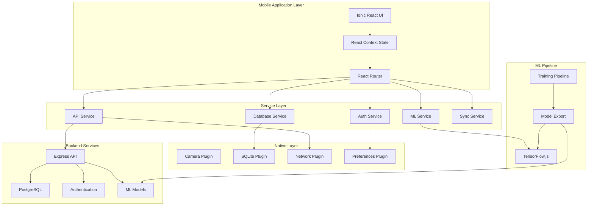
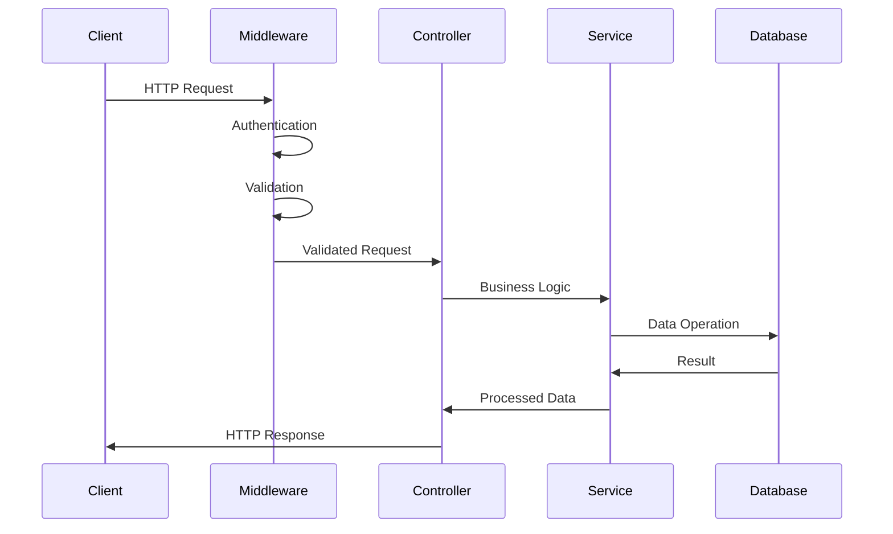
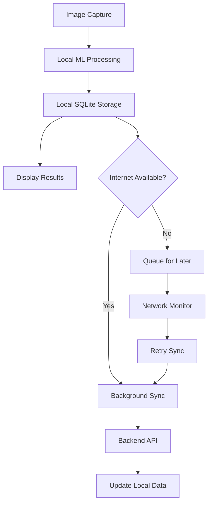
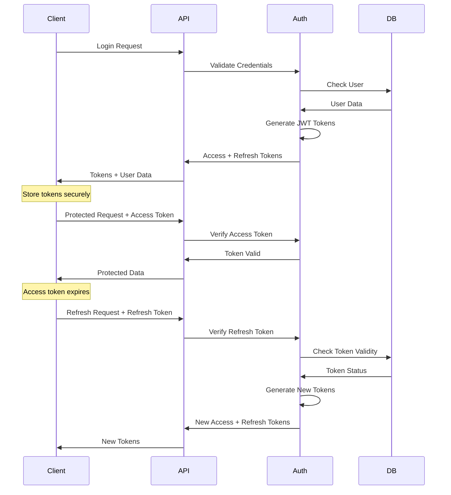

# 🏗️ GingerlyAI System Architecture

## 📋 Overview

GingerlyAI is designed as a **hybrid offline-first mobile application** that leverages modern web technologies, native mobile capabilities, and advanced machine learning to provide farmers with reliable ginger disease detection and treatment recommendations, even in areas with limited internet connectivity.

---

## 🎯 Design Principles

### **1. Offline-First Architecture**
- Core functionality works without internet connection
- Smart synchronization when connectivity is available
- Local data persistence with SQLite
- Client-side machine learning inference

### **2. Progressive Enhancement**
- Basic functionality available offline
- Enhanced features when online
- Graceful degradation of services
- Automatic feature detection

### **3. Mobile-Native Experience**
- Touch-optimized user interface
- Native camera integration
- Platform-specific optimizations
- Battery and performance conscious

### **4. Scalable Backend**
- Stateless API design
- Horizontal scaling capabilities
- Database connection pooling
- Efficient resource management

### **5. Security by Design**
- JWT-based authentication
- Role-based access control
- Input validation at all layers
- Secure data transmission

---

## 🏛️ High-Level Architecture



---

## 📱 Mobile Application Architecture

### **Component Hierarchy**

```
App (Root Component)
├── AuthProvider (Authentication Context)
├── AppProvider (Application State Context)
├── IonReactRouter (Routing)
└── IonRouterOutlet
    ├── Public Routes
    │   ├── Login
    │   └── Register
    ├── Protected Routes
    │   ├── Home
    │   ├── Camera
    │   ├── Results
    │   ├── History
    │   ├── Profile
    │   └── Settings
    └── Admin Routes
        ├── AdminDashboard
        ├── AdminUsers
        ├── AdminRemedies
        └── AdminModels
```

### **State Management Architecture**

```javascript
// Context-based state management
AuthContext {
  user: User | null
  tokens: Tokens | null
  isAuthenticated: boolean
  isLoading: boolean
  error: string | null
}

AppContext {
  isOnline: boolean
  lastSyncTime: Date | null
  syncStatus: 'idle' | 'syncing' | 'success' | 'error'
  notifications: Notification[]
  error: string | null
}
```

### **Service Layer Architecture**

```typescript
interface ServiceLayer {
  AuthService: {
    login(email, password): Promise<AuthResponse>
    register(userData): Promise<AuthResponse>
    refreshToken(): Promise<TokenResponse>
    logout(): Promise<void>
  }
  
  MLService: {
    initialize(): Promise<void>
    predict(imageUri): Promise<PredictionResult>
    loadModel(modelId?): Promise<void>
    warmUpModel(): Promise<void>
  }
  
  DatabaseService: {
    initialize(): Promise<void>
    savePrediction(prediction): Promise<void>
    getPredictions(userId): Promise<Prediction[]>
    saveRemedies(remedies): Promise<void>
    getRemedies(): Promise<Remedy[]>
  }
  
  SyncService: {
    syncPredictions(): Promise<SyncResult>
    syncRemedies(): Promise<SyncResult>
    checkModelUpdates(): Promise<SyncResult>
    fullSync(): Promise<SyncResult>
  }
  
  ApiService: {
    request(endpoint, options): Promise<Response>
    get(endpoint): Promise<Response>
    post(endpoint, data): Promise<Response>
    put(endpoint, data): Promise<Response>
    delete(endpoint): Promise<Response>
  }
}
```

---

## 🔧 Backend API Architecture

### **Layered Architecture**

```
┌─────────────────────────────────────┐
│           Presentation Layer         │
│  ┌─────────────────────────────────┐ │
│  │      Routes & Controllers       │ │
│  │  • Route definitions            │ │
│  │  • Request/Response handling    │ │
│  │  • Input validation            │ │
│  └─────────────────────────────────┘ │
└─────────────────────────────────────┘
┌─────────────────────────────────────┐
│            Business Layer           │
│  ┌─────────────────────────────────┐ │
│  │         Services                │ │
│  │  • Business logic               │ │
│  │  • Domain operations            │ │
│  │  • Data processing              │ │
│  └─────────────────────────────────┘ │
└─────────────────────────────────────┘
┌─────────────────────────────────────┐
│          Middleware Layer           │
│  ┌─────────────────────────────────┐ │
│  │    Authentication & Security    │ │
│  │  • JWT verification             │ │
│  │  • Role-based access control    │ │
│  │  • Input validation             │ │
│  │  • Error handling               │ │
│  │  • Logging                      │ │
│  └─────────────────────────────────┘ │
└─────────────────────────────────────┘
┌─────────────────────────────────────┐
│           Data Access Layer         │
│  ┌─────────────────────────────────┐ │
│  │      Models & Database          │ │
│  │  • Sequelize ORM                │ │
│  │  • Database models              │ │
│  │  • Query optimization           │ │
│  │  • Connection pooling           │ │
│  └─────────────────────────────────┘ │
└─────────────────────────────────────┘
```

### **Request Flow**



### **Database Schema Architecture**

```sql
-- Core Entities
Users (id, name, email, role, location, farmSize)
  ↓ 1:N
Predictions (id, userId, modelId, remedyId, imageUrl, results)
  ↓ N:1
Remedies (id, diseaseName, description, treatments)
Models (id, name, version, accuracy, isActive)

-- Authentication
RefreshTokens (id, userId, token, expiresAt)

-- Audit
CreatedAt, UpdatedAt, DeletedAt (soft delete)
```

---

## 🤖 Machine Learning Architecture

### **Training Pipeline**

```mermaid
graph LR
    Raw[Raw Images] --> Preprocess[Data Preprocessing]
    Preprocess --> Augment[Data Augmentation]
    Augment --> Split[Train/Val/Test Split]
    Split --> Train[Model Training]
    Train --> Evaluate[Model Evaluation]
    Evaluate --> Export[TensorFlow.js Export]
    Export --> Deploy[Model Deployment]
    Deploy --> Monitor[Performance Monitoring]
    Monitor --> Retrain[Model Retraining]
    Retrain --> Train
```



### **Model Architecture**

```python
# CNN Architecture for Ginger Disease Detection
Input: (224, 224, 3) RGB Images
  ↓
Data Augmentation Layer
  ↓ 
EfficientNetB0/MobileNetV2 (Pre-trained)
  ↓
GlobalAveragePooling2D
  ↓
BatchNormalization
  ↓
Dropout(0.5)
  ↓
Dense(512, activation='relu', L2 regularization)
  ↓
BatchNormalization
  ↓
Dropout(0.5)
  ↓
Dense(256, activation='relu', L2 regularization)
  ↓
Dropout(0.3)
  ↓
Dense(7, activation='softmax') # 7 disease classes
```

### **Mobile Inference Pipeline**

```javascript
// TensorFlow.js Inference Pipeline
const inferencePipeline = {
  1: "Image Loading",
  2: "Preprocessing (Resize to 224x224)",
  3: "Normalization (0-1 range)",
  4: "ImageNet Normalization",
  5: "Add Batch Dimension",
  6: "Model Prediction",
  7: "Softmax Activation",
  8: "Result Processing",
  9: "Cleanup Memory"
}
```

---

## 🔄 Data Flow Architecture

### **Offline-First Data Flow**



### **Synchronization Strategy**

```javascript
// Sync Priority Order
const syncStrategy = {
  1: "User Authentication State",
  2: "Critical Predictions (High Confidence)",
  3: "Model Updates",
  4: "Remedy Information Updates", 
  5: "Historical Predictions",
  6: "User Profile Updates",
  7: "Analytics Data"
}
```

---

## 🚀 Deployment Architecture

### **Development Environment**

```
┌─────────────────────────────────────┐
│          Development Setup          │
├─────────────────────────────────────┤
│  Frontend: http://localhost:8100    │
│  Backend:  http://localhost:3000    │
│  Database: SQLite (local file)      │
│  ML Training: Local Python env      │
└─────────────────────────────────────┘
```

### **Production Environment**

```
┌─────────────────────────────────────┐
│           Load Balancer             │
│        (Nginx/CloudFlare)           │
└─────────────┬───────────────────────┘
              │
┌─────────────▼───────────────────────┐
│         Application Servers        │
│       (Node.js + Express)          │
│         (Horizontal Scale)          │
└─────────────┬───────────────────────┘
              │
┌─────────────▼───────────────────────┐
│         Database Layer              │
│      (PostgreSQL + Redis)          │
│         (Replication)               │
└─────────────────────────────────────┘
```

### **Mobile App Distribution**

```
┌─────────────────────────────────────┐
│           Source Code               │
└─────────────┬───────────────────────┘
              │
         ┌────▼────┐
         │  Build  │
         └────┬────┘
              │
    ┌─────────▼─────────┐
    │                   │
┌───▼───┐           ┌───▼───┐
│  iOS  │           │Android│
│ Build │           │ Build │
└───┬───┘           └───┬───┘
    │                   │
┌───▼───┐           ┌───▼───┐
│ App   │           │Google │
│ Store │           │ Play  │
└───────┘           └───────┘
```

---

## 🔐 Security Architecture

### **Authentication Flow**



### **Data Security Layers**

```
┌─────────────────────────────────────┐
│        Application Security         │
│  • Input validation                 │
│  • Output sanitization              │
│  • Business logic authorization     │
└─────────────────────────────────────┘
┌─────────────────────────────────────┐
│        Transport Security           │
│  • HTTPS/TLS encryption             │
│  • Certificate pinning              │
│  • Request/Response encryption      │
└─────────────────────────────────────┘
┌─────────────────────────────────────┐
│         Storage Security            │
│  • Database encryption              │
│  • Password hashing (bcrypt)        │
│  • Secure token storage             │
└─────────────────────────────────────┘
┌─────────────────────────────────────┐
│        Infrastructure Security      │
│  • Network security                 │
│  • Server hardening                 │
│  • Access controls                  │
└─────────────────────────────────────┘
```

---

## ⚡ Performance Architecture

### **Mobile Performance Optimizations**

```javascript
// Performance Strategies
const performanceOptimizations = {
  "Code Splitting": "Dynamic imports for route-based splitting",
  "Lazy Loading": "Components loaded on demand", 
  "Image Optimization": "Compressed images, WebP format",
  "Bundle Optimization": "Tree shaking, minification",
  "Caching": "Service worker caching strategies",
  "Memory Management": "TensorFlow.js tensor cleanup",
  "Background Processing": "Web Workers for heavy tasks"
}
```

### **Backend Performance Strategies**

```javascript
// Backend Optimizations
const backendOptimizations = {
  "Connection Pooling": "Database connection reuse",
  "Query Optimization": "Indexed queries, eager loading",
  "Caching": "Redis for frequently accessed data",
  "Compression": "Gzip response compression",
  "Rate Limiting": "API abuse prevention",
  "Pagination": "Large dataset handling",
  "CDN": "Static asset delivery"
}
```

---

## 📊 Monitoring & Observability

### **Application Monitoring Stack**

```
┌─────────────────────────────────────┐
│           Metrics Layer             │
│  • Response times                   │
│  • Error rates                      │
│  • Throughput                       │
│  • Resource utilization             │
└─────────────────────────────────────┘
┌─────────────────────────────────────┐
│           Logging Layer             │
│  • Application logs (Winston)       │
│  • Access logs                      │
│  • Error logs                       │
│  • Security logs                    │
└─────────────────────────────────────┘
┌─────────────────────────────────────┐
│           Tracing Layer             │
│  • Request tracing                  │
│  • Database query tracing           │
│  • ML inference timing              │
│  • User journey tracking            │
└─────────────────────────────────────┘
```

### **Health Check Architecture**

```javascript
// Health Check Endpoints
const healthChecks = {
  "/health": "Basic service availability",
  "/health/detailed": "Component-level health",
  "/health/database": "Database connectivity",
  "/health/ml": "ML service availability",
  "/metrics": "Performance metrics"
}
```

---

## 🔄 Scalability Considerations

### **Horizontal Scaling Strategy**

```
┌─────────────────────────────────────┐
│           Load Balancer             │
└─────────────┬───────────────────────┘
              │
      ┌───────┼───────┐
      │       │       │
  ┌───▼───┐ ┌─▼─┐ ┌───▼───┐
  │App    │ │App│ │ App   │
  │Server │ │Svr│ │Server │
  │   1   │ │ 2 │ │   N   │
  └───────┘ └───┘ └───────┘
```

### **Database Scaling Strategy**

```
┌─────────────────────────────────────┐
│           Primary Database          │
│         (Read/Write Master)         │
└─────────────┬───────────────────────┘
              │
    ┌─────────┼─────────┐
    │         │         │
┌───▼───┐ ┌───▼───┐ ┌───▼───┐
│Read   │ │ Read  │ │ Read  │
│Replica│ │Replica│ │Replica│
│   1   │ │   2   │ │   N   │
└───────┘ └───────┘ └───────┘
```

---

## 🚀 Future Architecture Considerations

### **Microservices Evolution**

```
Current Monolithic Backend → Future Microservices
┌─────────────────────────────────────┐
│         Express Monolith            │
└─────────────────────────────────────┘
                  ↓
┌─────────┐ ┌─────────┐ ┌─────────┐
│  Auth   │ │   ML    │ │  Data   │
│Service  │ │Service  │ │Service  │
└─────────┘ └─────────┘ └─────────┘
```

### **Edge Computing Integration**

```
┌─────────────────────────────────────┐
│           Mobile Device             │
│  • Local ML inference              │
│  • Edge caching                    │
│  • Offline processing              │
└─────────────────────────────────────┘
┌─────────────────────────────────────┐
│           Edge Servers              │
│  • Regional ML models              │
│  • Data aggregation                │
│  • Content delivery                │
└─────────────────────────────────────┘
┌─────────────────────────────────────┐
│         Central Cloud               │
│  • Model training                  │
│  • Data analytics                  │
│  • Global coordination             │
└─────────────────────────────────────┘
```

---

This architecture provides a robust, scalable, and maintainable foundation for the GingerlyAI application, ensuring reliable performance across various deployment scenarios while maintaining security and user experience standards.
