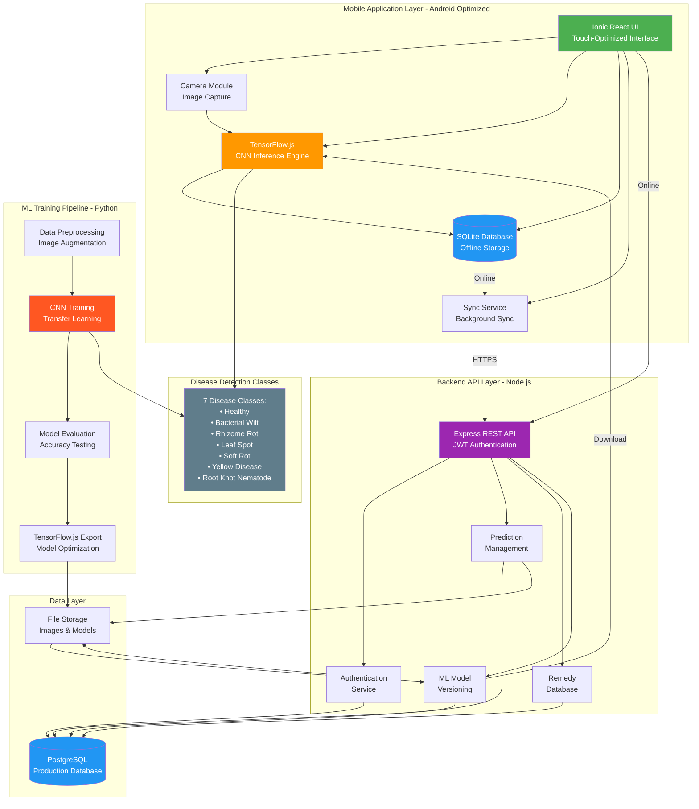
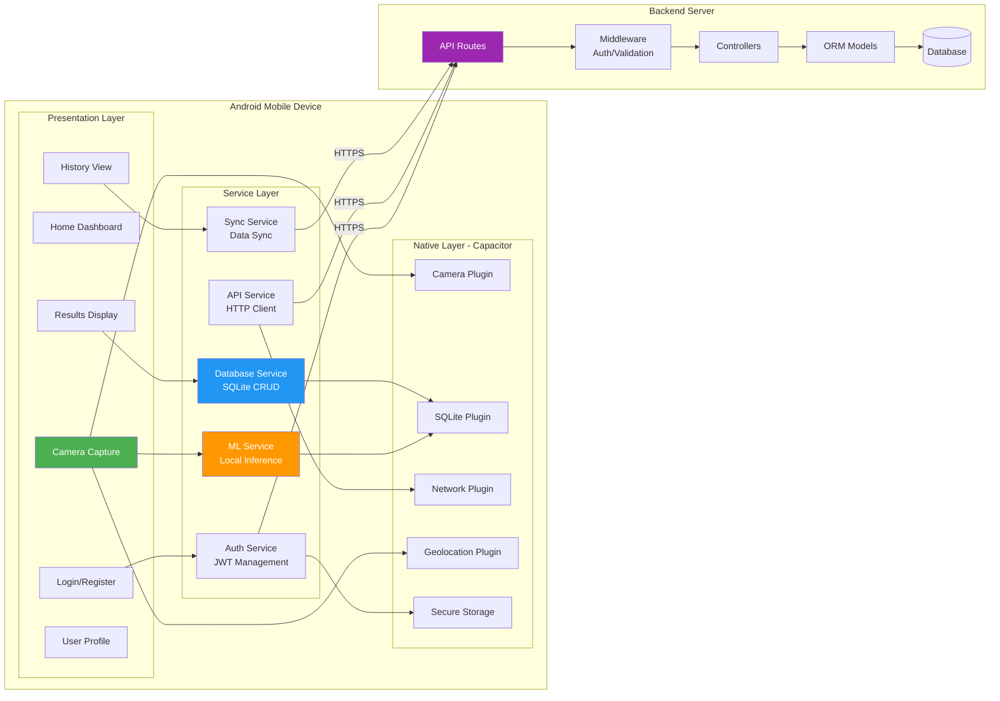
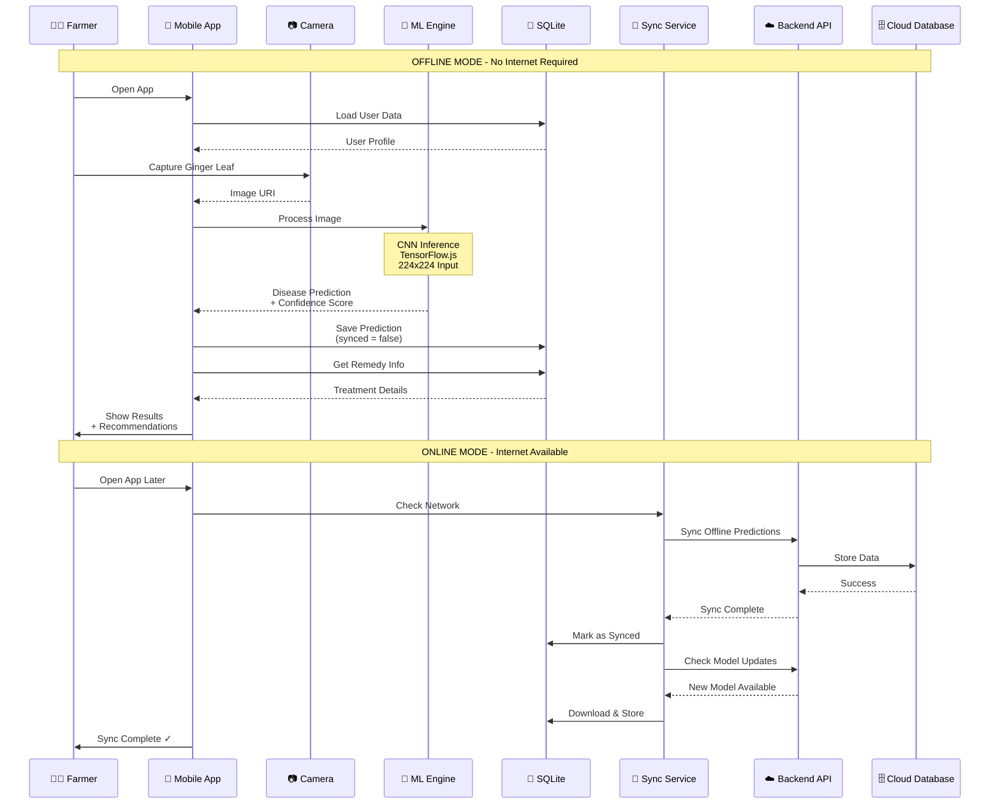
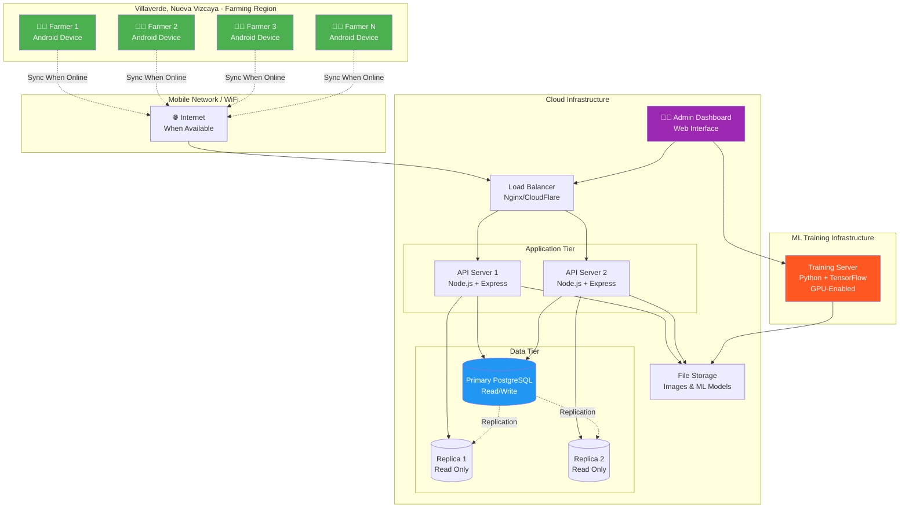

# GingerlyAI System Architecture Diagram

## High-Level System Architecture



## Detailed Component Architecture



## Data Flow Architecture - Offline-First



## ML Training to Deployment Pipeline

```mermaid
graph TD
    Start[Raw Ginger Images] --> Collect[Data Collection<br/>7 Disease Classes]
    Collect --> Organize[Organize Dataset<br/>Train/Val/Test Split]
    
    Organize --> Preprocess[Preprocessing<br/>• Resize to 224x224<br/>• Normalization<br/>• Augmentation]
    
    Preprocess --> Select[Select Base Model<br/>EfficientNetB0 or<br/>MobileNetV2]
    
    Select --> Transfer[Transfer Learning<br/>• Load ImageNet Weights<br/>• Freeze Base Layers<br/>• Train Head Only]
    
    Transfer --> FineTune[Fine-Tuning<br/>• Unfreeze Top Layers<br/>• Lower Learning Rate<br/>• Train End-to-End]
    
    FineTune --> Evaluate[Evaluation<br/>• Accuracy Testing<br/>• Confusion Matrix<br/>• Confidence Analysis]
    
    Evaluate --> Decision{Accuracy<br/>>90%?}
    Decision -->|No| Preprocess
    Decision -->|Yes| Optimize[Model Optimization<br/>• Quantization<br/>• Graph Optimization]
    
    Optimize --> ExportTFJS[Export TensorFlow.js<br/>• JSON Model<br/>• Binary Weights<br/>• Metadata]
    
    ExportTFJS --> Upload[Upload to Backend<br/>Model Versioning]
    
    Upload --> Admin[Admin Activates Model<br/>via Dashboard]
    
    Admin --> Mobile[Mobile Devices<br/>Download Update]
    
    Mobile --> Deploy[Deployed on Device<br/>Ready for Offline Use]
    
    style Start fill:#E3F2FD
    style Transfer fill:#FFF3E0
    style Evaluate fill:#F3E5F5
    style Decision fill:#FFEBEE
    style ExportTFJS fill:#E8F5E9
    style Deploy fill:#4CAF50,color:#fff
```



## Network Topology - Deployment Architecture



## Technology Stack Overview

```
┌─────────────────────────────────────────────────────────────────┐
│                    MOBILE APPLICATION LAYER                      │
│                   (Android Optimized - API 21+)                  │
├─────────────────────────────────────────────────────────────────┤
│  Framework:    Ionic React 7.5.5 + Capacitor 5.5.1             │
│  UI Library:   React 18.2.0                                     │
│  Routing:      React Router 5.3.4                              │
│  State:        React Context API                               │
│  ML Engine:    TensorFlow.js 4.12.0 (WebGL/CPU)               │
│  Database:     SQLite (Capacitor Community Plugin)             │
│  Camera:       Capacitor Camera Plugin                         │
│  Storage:      Capacitor Preferences (Secure)                  │
│  Network:      Capacitor Network Plugin                        │
│  Location:     Capacitor Geolocation                           │
└─────────────────────────────────────────────────────────────────┘
                              ↕ HTTPS (When Online)
┌─────────────────────────────────────────────────────────────────┐
│                      BACKEND API LAYER                           │
├─────────────────────────────────────────────────────────────────┤
│  Runtime:      Node.js 18+                                      │
│  Framework:    Express 4.18.2                                   │
│  Database:     PostgreSQL 12+ (Production)                      │
│                SQLite 5.1.7 (Development)                       │
│  ORM:          Sequelize 6.35.2                                 │
│  Auth:         JWT (jsonwebtoken 9.0.2)                        │
│  Security:     bcrypt, helmet, cors, rate-limit                │
│  Validation:   Joi 17.11.0                                      │
│  File Upload:  Multer 1.4.5                                     │
│  Logging:      Winston 3.11.0                                   │
└─────────────────────────────────────────────────────────────────┘
                              ↕
┌─────────────────────────────────────────────────────────────────┐
│                   ML TRAINING PIPELINE                           │
├─────────────────────────────────────────────────────────────────┤
│  Language:     Python 3.9+                                      │
│  ML Framework: TensorFlow 2.13.0                               │
│  High-Level:   Keras 2.13.1                                     │
│  Export:       TensorFlowJS 4.12.0                             │
│  Processing:   NumPy, Pandas, OpenCV, Pillow                   │
│  Augment:      Albumentations, imgaug                          │
│  Visualize:    Matplotlib, Seaborn, Plotly                     │
│  Base Models:  EfficientNetB0, MobileNetV2                     │
│  Training:     Transfer Learning + Fine-Tuning                  │
│  Output:       Quantized TensorFlow.js Model (5-15 MB)         │
└─────────────────────────────────────────────────────────────────┘
```

## Key Features & Capabilities

### 🌐 Offline-First Architecture
- **Complete offline functionality**: Disease detection works without internet
- **Local SQLite database**: Stores predictions, remedies, and ML models
- **Smart synchronization**: Background sync when network available
- **Conflict resolution**: Handles offline changes gracefully

### 🤖 CNN-Based Disease Detection
- **7 Disease classes**: Healthy + 6 ginger diseases
- **High accuracy**: >90% classification accuracy
- **Fast inference**: 500-1000ms on mid-range Android devices
- **Optimized models**: Transfer learning with EfficientNetB0/MobileNetV2

### 📱 Mobile-Optimized Performance
- **Android API 21+**: Compatible with devices from 2014 onwards
- **Memory efficient**: 50-100MB during inference
- **Battery conscious**: Optimized CPU/GPU usage
- **Small model size**: 5-15MB (quantized)

### 🔒 Security & Privacy
- **JWT authentication**: Secure token-based auth
- **Role-based access**: User and Admin roles
- **Encrypted storage**: Secure local data storage
- **Password hashing**: bcrypt with salt

### 🔄 Synchronization Strategy
1. User authentication state (highest priority)
2. Critical predictions (high confidence)
3. ML model updates
4. Remedy information updates
5. Historical predictions
6. User profile updates
7. Analytics data

---

## System Requirements

### Mobile Device Requirements (Farmers)
- **OS**: Android 5.0 (API 21) or higher
- **RAM**: 2GB minimum, 4GB recommended
- **Storage**: 500MB free space
- **Camera**: Any resolution (will be processed to 224x224)
- **Internet**: Optional (only for sync and updates)

### Backend Server Requirements
- **OS**: Linux/Windows Server
- **Runtime**: Node.js 18+
- **Database**: PostgreSQL 12+
- **RAM**: 4GB minimum, 8GB recommended
- **Storage**: 50GB+ (for images and models)
- **Network**: Public IP with HTTPS

### ML Training Requirements
- **OS**: Linux/Windows with Python 3.9+
- **GPU**: CUDA-capable GPU (4GB+ VRAM) recommended
- **RAM**: 16GB minimum, 32GB recommended
- **Storage**: 100GB+ (for dataset and models)
- **Framework**: TensorFlow 2.13.0 with GPU support

---

**Document Version**: 1.0  
**Last Updated**: October 26, 2025  
**Project**: GingerlyAI - Ginger Disease Detection System  
**Target Region**: Villaverde, Nueva Vizcaya, Philippines

